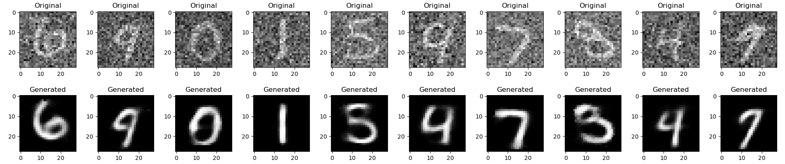

<h1 align="center">Back-Propagation<br>
Implementation from Scratch :brain:</h1>



This is the source repository for the article [Implementación del Algoritmo de Back-Propagation Para su Aplicación en la Clasificación, Regresión e IA Generativa](https://www.researchgate.net/publication/379594476), which seeks to set a solid mathematical foundation for the Back-Propagation algorithm and aims to implement a simple neural network library written in Python using such an algorithm, including functionalities for both forward and backward propagation. The neural network consists of customizable sequential layers, allowing the user to define the architecture, activation functions, and their derivatives. The project also includes implementations of three optimization algorithms: gradient descent, momentum gradient descent, and Adam.

## NeuralNetwork Class

The `NeuralNetwork` class is the core component of this project. It allows users to create and configure a neural network by adding sequential layers. The key methods include:

- **\_\_init\_\_(self)**: Initializes an empty list to store layers.
- **set(self, layer)**: Adds a layer to the neural network.
- **feedforward(self, X, n=None)**: Performs forward propagation through the network up to the nth layer or the last layer if n is not specified.
- **backpropagation(self, X, y)**: Implements backpropagation to update the weights and biases of each layer based on the given input data and target output.

## SequentialLayer Class

The `SequentialLayer` class represents a single layer in the neural network. Each layer includes weights, biases, an activation function, and its derivative. Users can customize the layer by specifying the number of input and output units, as well as the activation functions. The key methods include:

- **\_\_init\_\_(self, input, output, activation, activation\_derivative)**: Initializes the layer with random weights and biases.
- **z(self, A\_prev)**: Calculates the weighted sum of inputs and biases.
- **A(self, A\_prev)**: Applies the activation function to the weighted sum.

## Utility Functions

### Cross Entropy Function

The `cross_entropy` function calculates the cross-entropy loss between predicted and actual values.

### Optimization Algorithms

Three optimization algorithms are implemented:

1. **gradient\_descent(model, X, y, measure\_function, epochs=100, learning\_rate=0.01)**: Performs gradient descent optimization on the model.

2. **momentum\_gradient\_descent(model, X, y, measure\_function, epochs=100, learning\_rate=0.01)**: Applies momentum gradient descent optimization.

3. **Adam(model, X, y, measure\_function, epochs=100, learning\_rate=0.01)**: Implements the Adam optimization algorithm.

## Usage Example

Whatever your network structure should be, this code will always work as a reference for you

```python
# Import the necessary classes and functions
from NNScratchLib.models.MultiClassModels import NeuralNetwork
from NNScratchLib.models.Layers import SequentialLayer

from NNScratchLib.functions import activation_functions
from NNScratchLib.functions import measure_functions
from NNScratchLib.functions import optimizers

# Create a neural network
model = NeuralNetwork()

# Add layers to the network
model.set(SequentialLayer(input_size, hidden_size, activation_function, activation_derivative))
model.set(SequentialLayer(hidden_size, output_size, activation_function, activation_derivative))

# Train the model using gradient descent
acc_list, loss_list = gradient_descent(model, X_train, y_train, measure_function, epochs=100, learning_rate=0.01)
```

### Examples

The next chunk of code implements the autoencoder used to generate the next pictures, which were also given at the beginning of this repository.


Here you have a simplification, but the complete implementation can be found in [tests](tests.ipynb)

```python
# Import the necessary classes and functions
from NNScratchLib.models.MultiClassModels import NeuralNetwork
from NNScratchLib.models.Layers import SequentialLayer

from NNScratchLib.functions import activation_functions as af
from NNScratchLib.functions import measure_functions
from NNScratchLib.functions import generative_optimizers

noiseRedAutoencoder = NeuralNetwork()
noiseRedAutoencoder.set(SequentialLayer(784, 128, activation=af.sigmoid,
                                activation_derivate=af.sigmoid_derivate))
noiseRedAutoencoder.set(SequentialLayer(128, 9, activation=af.sigmoid,
                                activation_derivate=af.sigmoid_derivate))
noiseRedAutoencoder.set(SequentialLayer(9, 128, activation=af.sigmoid,
                                activation_derivate=af.sigmoid_derivate))
noiseRedAutoencoder.set(SequentialLayer(128, 784, activation=af.sigmoid,
                                activation_derivate=af.mse_derivate))

# Data processing ...

generative_optimizers.gradient_descent_autoenc(noiseRedAutoencoder, noised_x_train, x_train, epochs=250, learning_rate=0.01);
```
